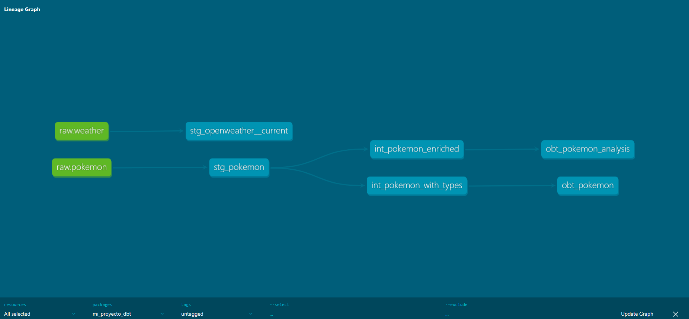
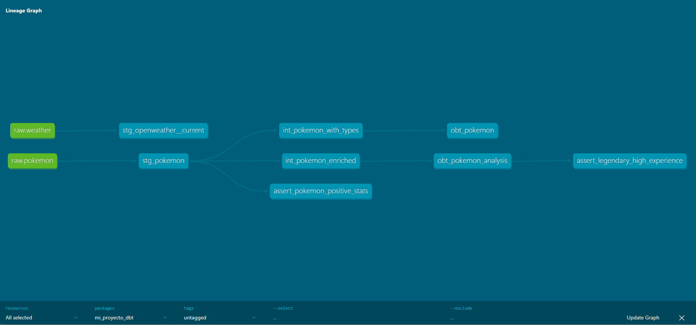

# mi_proyecto_dbt

Proyecto dbt para la Maestría en Inteligencia Artificial - MIA 03  
Facultad Politécnica - Universidad Nacional de Asunción
Mathias Chaparro
---

## Stack

| Componente | Tecnología |
|---|---|
| Fuentes | PokeAPI + Open-Meteo |
| Transformación | dbt-duckdb 1.9.0 |
| Almacenamiento | MotherDuck (DuckDB cloud) |

---

## Clase 5 — Modelos y Transformaciones

### Estructura del proyecto

```
models/
├── staging/
│   ├── sources.yml
│   ├── stg_pokemon.sql                  # Limpieza datos PokeAPI
│   └── stg_openweather__current.sql     # Limpieza datos Open-Meteo
├── intermediate/
│   └── int_pokemon_enriched.sql         # Extracción tipos JSON + bmi_ratio
└── marts/
    └── obt_pokemon_analysis.sql         # OBT final con power_tier
```

### Capas de transformación

```
source: main.pokemon         source: main.weather
        ↓                            ↓
stg_pokemon              stg_openweather__current
        ↓
int_pokemon_enriched
        ↓
obt_pokemon_analysis
```

### DAG — Clase 5



### Comandos

```bash
dbt run         # Ejecutar modelos
dbt docs serve  # Ver documentación y DAG
```

---

## Clase 6 — Testing y Documentación

### Tests implementados

| Tipo | Test | Modelo |
|---|---|---|
| Genérico | unique, not_null | stg_pokemon, obt_pokemon_analysis |
| Genérico | accepted_values | obt_pokemon_analysis.power_tier |
| dbt-expectations | expect_table_row_count_to_be_between | stg_pokemon, stg_openweather__current |
| dbt-expectations | expect_column_values_to_be_between | height, base_experience, temp_mean |
| dbt-expectations | expect_column_values_to_match_regex | pokemon_name |
| dbt-expectations | expect_column_values_to_be_in_type_list | pokemon_id |
| Singular | assert_pokemon_positive_stats | stg_pokemon |
| Singular | assert_legendary_high_experience | obt_pokemon_analysis |

### Resultado dbt build

```
PASS=29  WARN=0  ERROR=0  SKIP=0  TOTAL=29
```

### DAG con documentación — Clase 6



### Comandos

```bash
dbt build           # Run + test en orden de dependencias
dbt test            # Solo tests
dbt docs generate   # Generar documentación estática
dbt docs serve      # Servir documentación en localhost:8080
```